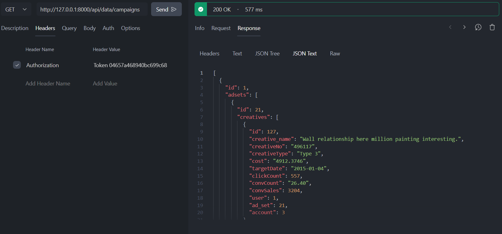
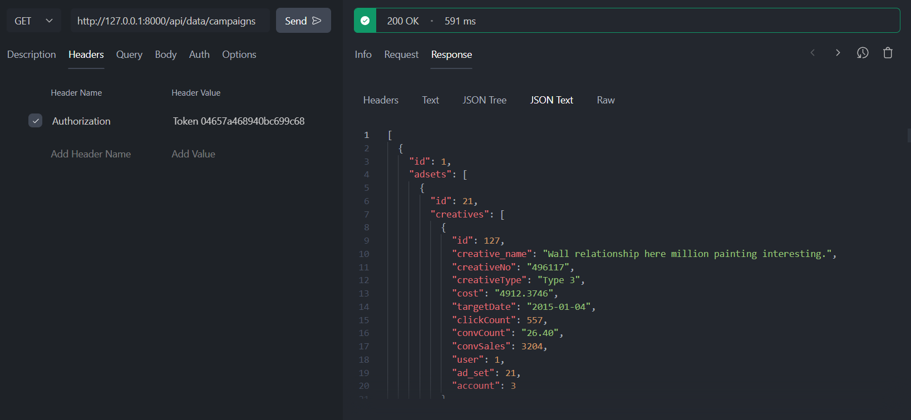
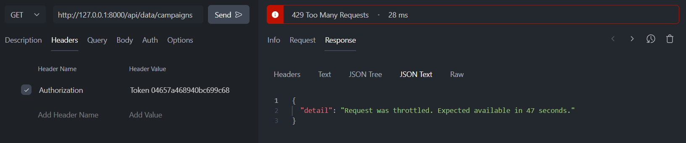
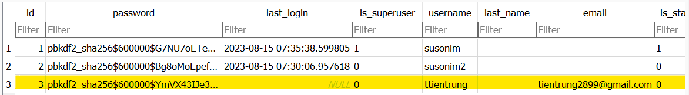
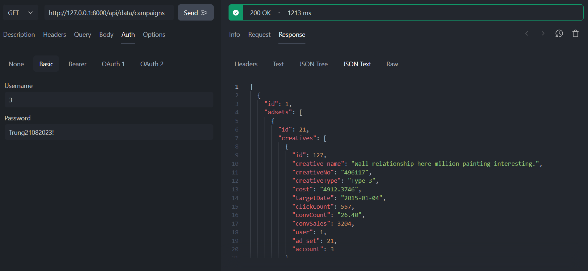

## Burning Bros Junior Python Developer Assignment Submission.

### Result

### Mandatory Questions:

* 1. Nested Data API Implementation:
* - Result after update API to get all the nested data
* - /api/data/campaigns/

* - /api/data/adsets/

 

* 2. Prevent spaming API (Rate limit):
* - Limit each IP to a maximum of 10 requests per minute to the endpoints.

### Optional Questions:
* 1. (Optional) Base Authentication Change:
* - Change the base authentication field from username to user_id on the base user model.

 
